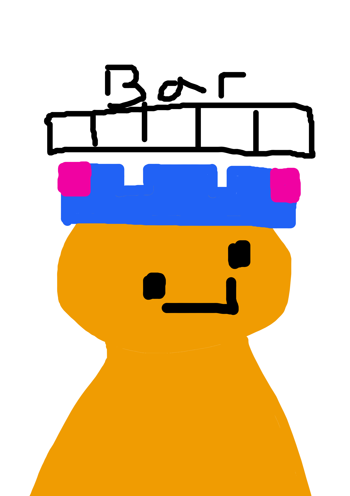

<div align="center">



# 🥭 MangoBar

**A macOS taskbar that replaces uBar — and can actually exclude the app pretending to be Java.**

Made by Mingyu 🧑‍💻

<br>


</div>

---

> [!NOTE]
> **MangoBar is completely free.** 🆓 It is macOS only — and it runs with **zero permissions**
> unless you turn on one of the two features that need one. 🔒

---

## 📖 Contents

| | | |
| --- | --- | --- |
| [🧐 Why this exists](#-why-this-exists) | [📥 Install](#-install) | [👀 Using it](#-using-it) |
| [🚫 Excluding apps](#-excluding-apps) | [🧩 Layout](#-layout) | [🔐 Permissions](#-permissions) |
| [⚙️ Configuration](#-configuration) | [🪫 Memory](#-memory) | [🚧 Known limitations](#-known-limitations) |
| [🗂️ Where things live](#-where-things-live) | [🔔 Updates](#-updates) | [🗑️ Uninstall](#-uninstall) |
| [⚖️ Licence](#-licence) | | |

---

## 🧐 Why this exists

uBar identifies apps by bundle id and display name only. That is why Minecraft shows up as
**"Java"** and cannot be excluded. MangoBar matches on bundle id, executable name, executable
path, or a regex, and lets you rename and re-icon anything it gets wrong.

```json
{"apps": {"overrides": [
  {"match": {"exec_name": "java", "mode": "exact"}, "name": "Minecraft", "exclude": true}
]}}
```

To be a hundred percent honest, the other reason is wanting my own version. 🥭

---

## 📥 Install

Grab the `.dmg` from **[the Releases page](https://github.com/mannnnnnnngo/Mangobar/releases)**, open
it, and drag **MangoBar** onto Applications. Needs macOS 13 or newer.

> [!IMPORTANT]
> The first time you open it, macOS blocks it — the app isn't signed with a paid Apple developer
> account. Double-click MangoBar, press **Done** on the warning, then go to
> **&#63743; → System Settings → Privacy & Security**, scroll to the bottom, and press **Open Anyway**.
> Press **Open Anyway** once more to confirm. You only do this once. 🔓

First run writes `~/.config/mangobar/config.json`.

---

## 👀 Using it

Right-click the bar → **Preferences…**. Eight tabs, mirroring uBar's layout:

| Tab | Contents |
|---|---|
| ⚙️ General | Position, size, margin, corner radius, display, login, hover behaviour |
| 🎨 Theme | Preset, four colour wells, opacity, blur, icon/font sizing |
| 🧩 Areas | Show Menu / Desktop / Battery / Trash / Separators / Clock |
| 📜 Menu | Which folders, utilities and power actions appear in the menu button |
| 📱 Apps | Included / Excluded lists |
| 🕒 Date & Time | Clock format, calendar |
| ⌨️ Shortcuts | Not implemented yet |
| 🔬 Advanced | Click behaviour, background apps, app order, debug logging |

Everything writes to the same JSON file, which you can also edit directly — changes apply within
about two seconds, no restart. ✨

---

## 🚫 Excluding apps

Preferences → **Apps** lists every running app, including background helpers. Select one and
press **→** to exclude it.

Exclusion is absolute: an excluded entry never appears in the bar, whatever launched it. Entries
are keyed by bundle id when there is one and by executable name when there isn't, so
terminal-launched processes and Java apps can be excluded too — which uBar cannot do.

To catch something with no bundle id, add a rule by hand:

```json
"apps": {"exclude": ["java", "node", {"exec_name": "python3", "mode": "exact"}]}
```

> [!TIP]
> Turn on **Advanced → Show background / terminal-launched apps** to make them visible in the bar
> first, so you can see what you are excluding. 👁️

---

## 🧩 Layout

The bar is three areas, each an ordered list of widgets. Rearranging it is a config edit:

```json
"areas": {
  "left":   ["menu", "desktop", "pinned", "tasks"],
  "center": [],
  "right":  ["battery", "trash", "clock"]
}
```

Available widgets: `menu` `desktop` `pinned` `tasks` `battery` `trash` `clock` `separator`

- **pinned** — compact squares, always visible whether the app is running or not
- **tasks** — wider labelled buttons for running apps that aren't pinned

---

## 🔐 Permissions

The bar works with **zero permissions**. Two optional features need one:

| Feature | Permission | Without it |
|---|---|---|
| 🖼️ Live window previews on hover | Screen Recording | Hover shows the name only |
| 🪟 Window titles, per-window switching, Show Desktop | Accessibility | Falls back to app-level clicks |

Nothing is requested until you use a feature that needs it.

---

## ⚙️ Configuration

Everything lives in `~/.config/mangobar/config.json`. The highlights:

| Key | Meaning |
|---|---|
| `bar.position` | `bottom` `top` `left` `right` |
| `bar.thickness` | Bar height in points (44 matches uBar) |
| `apps.pinned` | Bundle ids, always shown, in this order |
| `apps.include` / `apps.exclude` | Match rules; empty include = allow all |
| `apps.overrides` | Rename / re-icon / force-exclude misidentified apps |
| `appearance.icon_size` | Icon size (22 default) |
| `appearance.group_gap` | Space between pinned squares and task rectangles |
| `theme.background_opacity` | 0.0–1.0 |
| `behavior.clicking_active_hides` | Click the active app to hide it |

---

## 🪫 Memory

Roughly **82 MB** resident with the working set warm, falling to around 60 MB once the bar has
been idle for a few minutes and macOS reclaims the pages it isn't touching.

**It does not climb with uptime**, and that is the part worth saying out loud — a bar that sits
on screen all day is exactly the kind of thing that quietly grows to a gigabyte overnight. What
memory it does spend is proportional to activity rather than to how long it has been running:
rebuilding the bar costs about 18 KB and happens when an app launches, quits, or is switched to.
Left alone, the bar does not grow. 📉

---

## 🚧 Known limitations

- **`bar.position: "left"` / `"right"`** lay out horizontally; vertical layout is not implemented
  yet.
- **Attention flashing** (uBar's "Flash apps that want attention") has no public API, and is not
  implemented.
- **Per-window grouping, drag-to-reorder and auto-hide** are only partly there.

---

## 🗂️ Where things live

```
~/.config/mangobar/config.json
```

One file, yours, written on first run and re-read within about two seconds of any change. It is
not in this repository and never should be — a bar layout belongs to one machine. 📂

---

## 🔔 Updates

MangoBar checks [`updates/latest.json`](updates/latest.json) on this repository and tells you when a
newer version is out. It carries nothing about you, and the download is whatever is attached to the
matching release. 📡

---

## 🗑️ Uninstall

```bash
pkill -f mangobar
rm -rf /Applications/MangoBar.app ~/.config/mangobar
```

Nothing is installed system-wide; the Dock is never modified.

---

## ⚖️ Licence

MangoBar is **free to use** but **not open source**. It may not be redistributed, modified, resold,
reverse engineered, or presented as anyone else's work. The full terms are in [`LICENSE`](LICENSE).

Copyright © 2026 Mingyu. All rights reserved.

---

<div align="center">

**Made with 🥭 by Mingyu**

🆓 Free forever · 🔒 Zero permissions to run · 🚫 Excludes the app pretending to be Java

</div>
